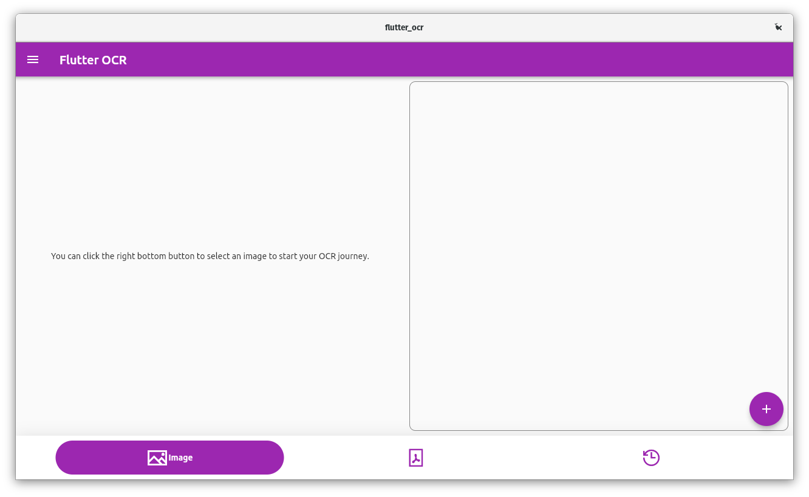

# flutter-ocr



### Installation
```bash
sudo snap install flutter-ocr --edge
```

### Based on
* https://flutter.dev/desktop
* https://pub.dev/packages/file_picker_cross
___
* https://github.com/JaidedAI/EasyOCR
___
* https://grpc.io
___
* https://snapcraft.io/#python
* https://snapcraft.io/#flutter

### Plan to use
https://github.com/Belval/pdf2image
https://realpython.com/creating-modifying-pdf/#installing-reportlab

___

https://pub.dev/packages/native_pdf_renderer
https://pub.dev/packages/pdf
https://pub.dev/packages/native_pdf_view
https://github.com/sooxt98/google_nav_bar
